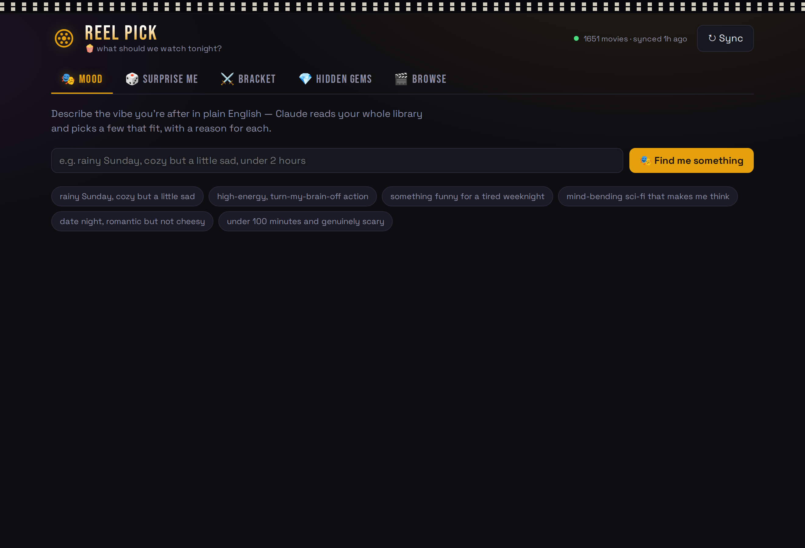
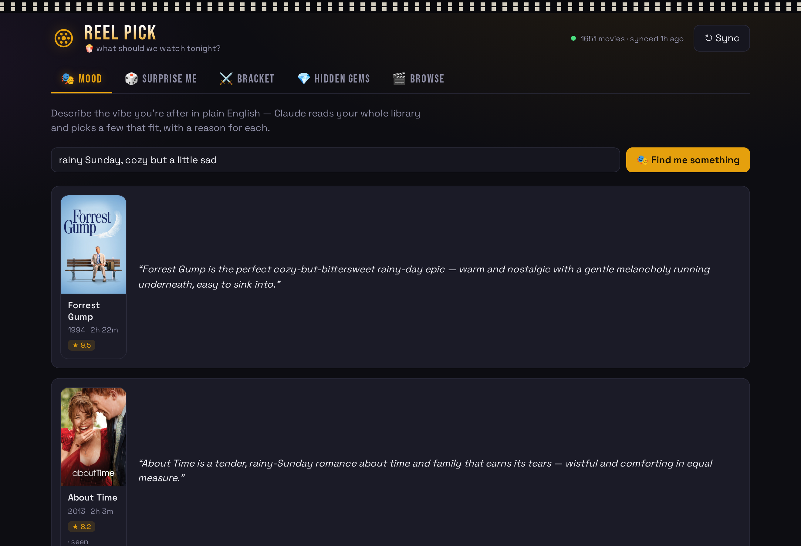
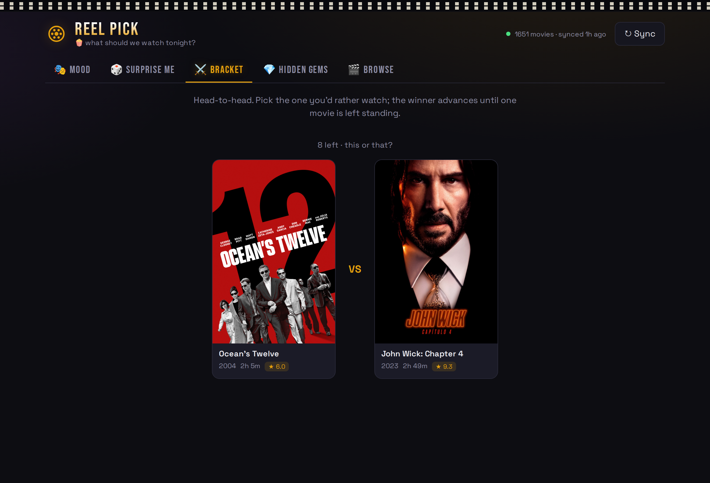
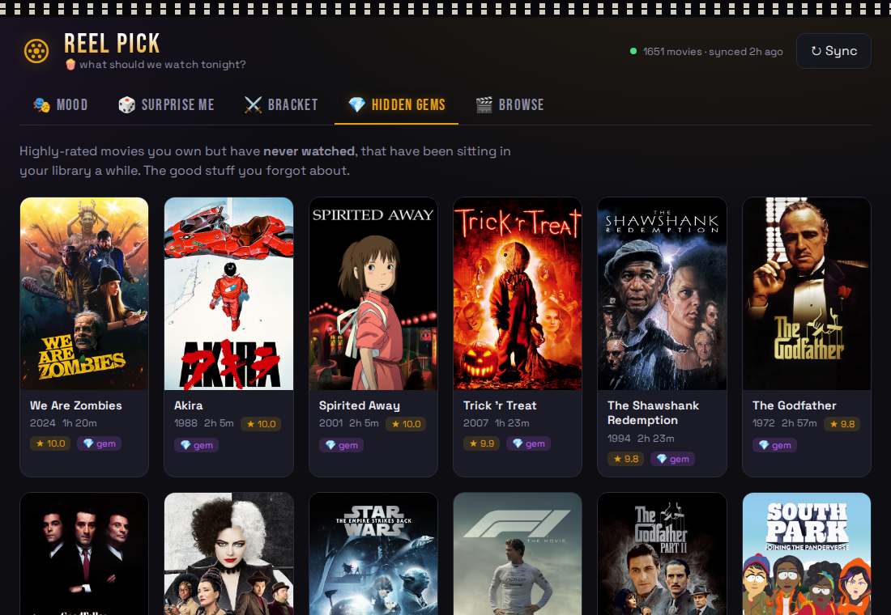
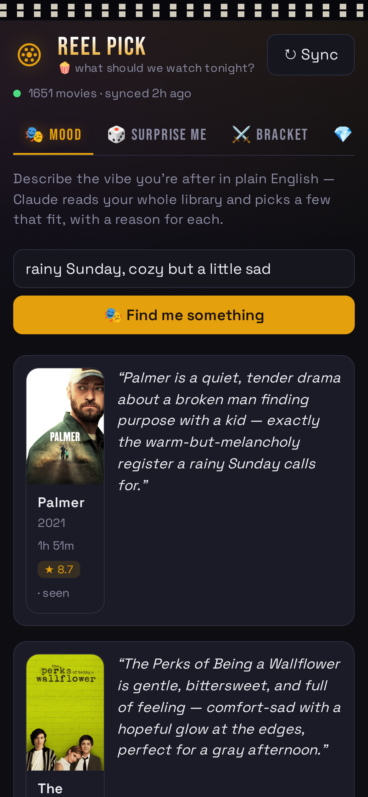

<div align="center">

# 🎬 Reel Pick

### Stop scrolling. Start watching.

A self-hosted web app that reads your **Plex** movie library and helps you decide what to watch. powered by **Claude** for mood-based picks.




</div>

---

## Star History

<a href="https://www.star-history.com/?repos=marsriot%2Fplex-movie-picker&type=date&legend=top-left">
 <picture>
   <source media="(prefers-color-scheme: dark)" srcset="https://api.star-history.com/chart?repos=marsriot/plex-movie-picker&type=date&theme=dark&legend=top-left" />
   <source media="(prefers-color-scheme: light)" srcset="https://api.star-history.com/chart?repos=marsriot/plex-movie-picker&type=date&legend=top-left" />
   
 </picture>
</a>
---
## Why?

You own hundreds of movies and still spend 25 minutes scrolling instead of watching one. Reel Pick fixes the *decision*, not the discovery - it shrinks your whole library down to one good choice, fast.

It syncs your Plex library into a local cache and gives you five ways to land on tonight's movie.

## ✨ Features

### 🎭 Mood - describe a vibe, get picks
Type what you're in the mood for in plain English. Claude reads your **entire** library and returns a few films that fit - matching tone and theme, not just genre tags; with a one-line reason for each.



### ⚔️ Bracket — this or that
Can't choose? Go head-to-head. Pick the poster you'd rather watch; the winner advances until one movie is left standing. Perfect for the couch.



### 💎 Hidden Gems - the good stuff you forgot you owned
Highly-rated movies in your library that you've **never watched** and that have been sitting there a while.



### 🎲 Surprise Me & 🎬 Browse
One-button random pick (with runtime/unwatched filters), plus a full browse view with search, genre/runtime filters, and sorting.

### 📱 Works on your phone
Fully responsive - run it at home and pull it up on the couch.

<div align="center">

</div>

---

## 🧱 Tech stack

| Layer | Stack |
|---|---|
| Backend | Python · FastAPI · [`python-plexapi`](https://github.com/pkkid/python-plexapi) · SQLite |
| Frontend | React · Vite |
| AI | Claude (`claude-opus-4-8`) via the Anthropic API, with prompt caching |

**How it works:** the backend syncs your Plex library into a local SQLite cache so the app stays fast and keeps working even if Plex hiccups. Poster images are proxied through the backend so your Plex token never reaches the browser. For mood picks, the full catalog is sent to Claude with prompt caching, so repeat queries are cheap.

---

## 🚀 Quick start

> **Prerequisites:** Python 3.11+, Node 18+, a Plex server, and an [Anthropic API key](https://console.anthropic.com) (only needed for the Mood feature).

### 1. Backend

```bash
cd backend
python3 -m venv .venv
source .venv/bin/activate
pip install -r requirements.txt
cp .env.example .env      # then edit .env — see below
uvicorn app.main:app --host 0.0.0.0 --port 8787
```

### 2. Frontend

```bash
cd frontend
npm install
npm run dev               # http://localhost:5173 (dev, hot-reload)
```

For everyday use, run the backend with `--host 0.0.0.0` and open **`http://<this-machine-ip>:8787`** from any device on your network - that single port serves the whole app.

Hit **↻ Sync** once to pull your library, then pick a movie.

### Configuration (`backend/.env`)

| Variable | What it is |
|---|---|
| `PLEX_URL` | e.g. `http://localhost:32400`, or `http://<plex-ip>:32400` |
| `PLEX_TOKEN` | Your Plex auth token (see below) |
| `PLEX_MOVIE_LIBRARY` | Your movie library's name in Plex (default `Movies`) |
| `ANTHROPIC_API_KEY` | For the Mood feature |

**Finding your Plex token:** in Plex Web, play any movie → ⋮ → **Get Info** → **View XML**, and copy the `X-Plex-Token=…` value from the URL. ([full guide](https://support.plex.tv/articles/204059436-finding-an-authentication-token-x-plex-token/))

> 🔒 `backend/.env` is gitignored - your tokens and API key never get committed.

---

## 🗺️ Roadmap

- [ ] Expose securely to friends outside the house (Cloudflare Tunnel)
- [ ] Group voting for movie night
- [ ] One-command launcher + scheduled auto-resync

## 📄 License

[MIT](LICENSE) - do whatever you like with it.

---

<div align="center">
<sub>Built with <a href="https://claude.com/claude-code">Claude Code</a> · 🍿</sub>
</div>
